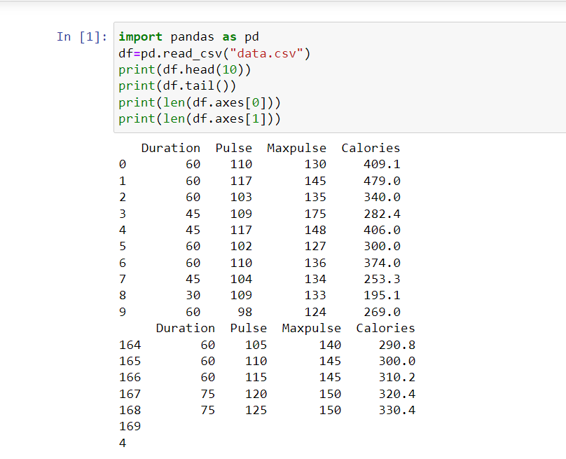

# Read-from-CSV

## AIM:
To write a python program for reading content from a CSV file.
## ALGORITHM:
### Step 1:
Import CSV file into Python using Pandas.
### Step 2:
Read the content of the csv file using pandas.read_csv 
### Step 3:
Print the first 10 rows of the dataframe ,using df.head(10).
### Step 4:
df.tail() returns the last n rows .
### Step 5:
Print the number of Rows using len(df.axes[0]).
### Step 6:
Print the number of Columns using len(df.axes[1]).
## PROGRAM:
```
import pandas as pd
df=pd.read_csv("data.csv")
print(df.head(10))
print(df.tail())
print(len(df.axes[0]))
print(len(df.axes[1]))
```
## OUTPUT:

## RESULT:
A python program for reading content from a CSV file is written.